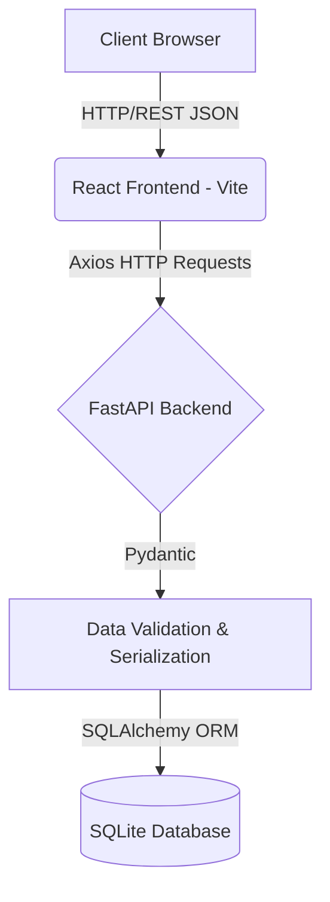
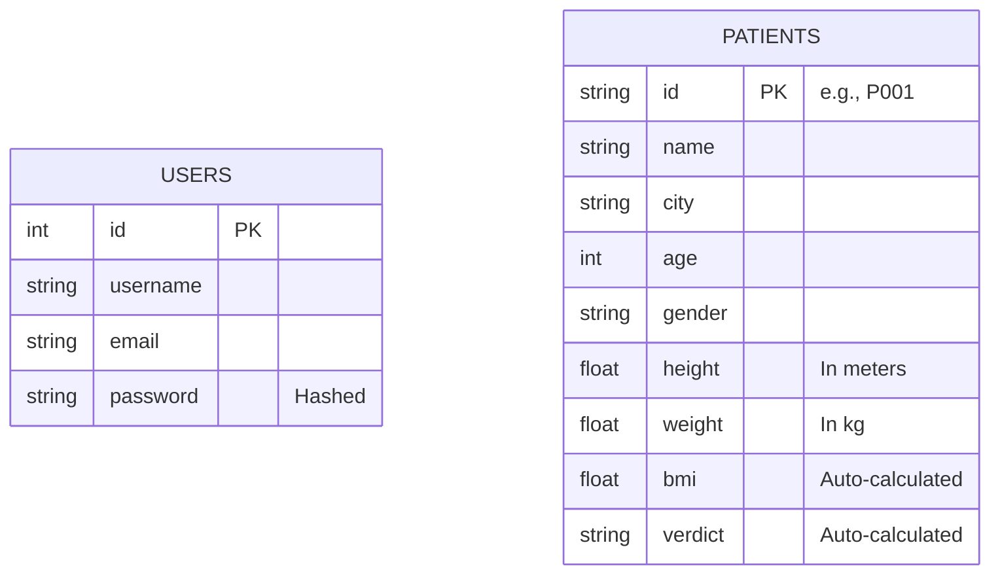
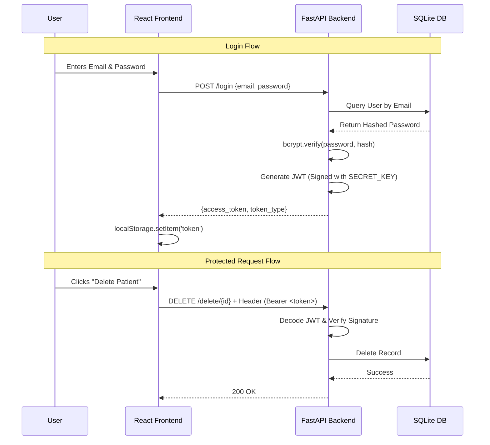

# System Design: Patient Management System

This document outlines the system architecture, component design, database schemas, and request lifecycles for the FastAPI + React Patient Management System. It is designed for new developer onboarding, project documentation, and interview preparation.

---

## 1. Project Overview

### Purpose
The Patient Management System is a full-stack web application designed to help healthcare administrators digitize and manage patient records efficiently. It provides a secure, centralized repository for tracking patient demographics and health metrics.

### Problem it Solves
Traditional paper-based or simple spreadsheet systems lack data validation, security, and the ability to quickly search or filter records. This application solves these issues by providing a robust relational database (SQLite via SQLAlchemy), strong schema validation (Pydantic), token-based security (JWT), and automated health metric calculations (BMI).

### Key Features
- **User Authentication:** Secure Signup/Login using bcrypt hashing and JWT.
- **Patient CRUD Operations:** Create, Read, Update, and Delete patient records.
- **Automated Health Metrics:** Automatic BMI calculation and categorization (Underweight, Normal, Overweight, Obese) upon data entry.
- **Advanced Search & Filtering:** Case-insensitive search by ID, Name, or City.
- **Responsive Dashboard:** A clean, React-based UI communicating with the backend via Axios.

---

## 2. High Level Architecture

The application follows a standard Client-Server 3-Tier Architecture.



### Layer Responsibilities
- **Frontend (React/Vite):** Handles user interface, client-side routing, state management, and presents data visually.
- **Backend Framework (FastAPI):** Exposes RESTful API endpoints, handles routing, and manages HTTP request/response cycles.
- **Validation Layer (Pydantic):** Ensures incoming HTTP payloads match the required data types and business rules before processing.
- **ORM Layer (SQLAlchemy):** Translates Python object operations into SQL queries, preventing SQL injection and abstracting database specifics.
- **Database (SQLite):** Persistent storage of user and patient records.

---

## 3. Folder Structure

```text
fastapi-demo-api/
│
├── backend/
│   ├── app/
│   │   ├── models/           # SQLAlchemy Database Models (Tables)
│   │   │   ├── patient.py
│   │   │   └── user.py
│   │   ├── schemas/          # Pydantic Schemas (Data Validation)
│   │   │   ├── auth.py
│   │   │   └── patient.py
│   │   ├── routers/          # API Route Definitions
│   │   │   ├── auth.py
│   │   │   └── patient.py
│   │   ├── utils/            # Helper functions
│   │   │   └── auth.py       # JWT generation and verification
│   │   ├── database.py       # Engine and SessionLocal setup
│   │   └── main.py           # FastAPI app instance and CORS config
│   │
│   ├── patients.db           # SQLite DB file
│   └── requirements.txt      # Python dependencies
│
└── frontend/
    ├── src/
    │   ├── pages/            # React View Components
    │   │   ├── Login.jsx
    │   │   ├── Signup.jsx
    │   │   └── Patients.jsx  # Main Dashboard
    │   ├── services/
    │   │   └── api.js        # Axios instance with Interceptors
    │   ├── App.jsx           # React Router Setup
    │   ├── main.jsx          # React DOM entry point
    │   └── index.css         # Global Styles
    ├── package.json
    └── vite.config.js
```

### Key Backend Components
- `main.py`: The entry point. Initializes FastAPI, configures CORS, and registers routers.
- `database.py`: Establishes the SQLite connection pool and dependency generator (`get_db`).
- `models/`: Defines the structure of the database tables using SQLAlchemy `Base`.
- `schemas/`: Defines the structure of incoming/outgoing JSON requests using Pydantic `BaseModel`.
- `routers/`: Groups related API endpoints (e.g., all patient endpoints in `routers/patient.py`).
- `utils/auth.py`: Contains the cryptographic logic for JWT signing and the `get_current_user` dependency.

### Key Frontend Components
- `pages/`: Contains the actual UI rendered for specific routes.
- `services/api.js`: Centralizes backend communication. It attaches the JWT token to outgoing requests automatically.

---

## 4. Request Lifecycle

### Example 1: Creating a Patient (Protected Route)

```text
1. User fills "Add Patient" form and clicks "Save"
   ↓
2. React triggers `api.post('/create', formData)`
   ↓
3. Axios Interceptor attaches `Authorization: Bearer <token>` header
   ↓
4. FastAPI Router (`@router.post('/create')`) receives request
   ↓
5. Dependency `get_current_user` decodes token and verifies user identity
   ↓
6. Pydantic `PatientCreate` schema validates the JSON payload
   ↓
7. SQLAlchemy instantiates `Patient` model. `before_insert` event calculates BMI
   ↓
8. Database (`db.commit()`) writes to `patients.db`
   ↓
9. Response (201 Created) returned to Frontend
   ↓
10. React updates state and closes the modal
```

### Example 2: Viewing Patients (Public Route)

```text
1. User navigates to Dashboard (`/`)
   ↓
2. React `useEffect` triggers `api.get('/view')`
   ↓
3. FastAPI Router (`@router.get('/view')`) receives request
   ↓
4. SQLAlchemy queries `SELECT * FROM patients`
   ↓
5. Pydantic `PatientResponse` schema sanitizes output (filters out passwords/metadata if any)
   ↓
6. Response (200 OK) JSON returned to Frontend
   ↓
7. React maps over JSON array to render patient cards
```

---

## 5. Database Design

### Entity Relationship (ER) Diagram



### Table Details
- **User Table**: Stores administrative credentials. Passwords are encrypted using `bcrypt`. Email has a unique constraint to prevent duplicate registrations.
- **Patient Table**: Stores healthcare data. `id` is typically an alphanumeric string provided by the hospital. `bmi` and `verdict` are calculated programmatically at the ORM layer, not submitted by the user.

---

## 6. Authentication Flow

The system uses stateless JSON Web Tokens (JWT) for authentication.

### Sequence Diagram



---

## 7. API Design

| Method | Endpoint | Description | Authentication Required |
|--------|----------|-------------|-------------------------|
| `POST` | `/signup` | Register a new admin user | ❌ No |
| `POST` | `/login` | Authenticate and retrieve JWT | ❌ No |
| `GET`  | `/view` | Retrieve a dictionary of all patients | ❌ No |
| `GET`  | `/patient/{id}` | Retrieve specific patient by ID (Path) | ❌ No |
| `GET`  | `/patients/search` | Search by Patient ID (Query) | ❌ No |
| `GET`  | `/patients/search/name` | Case-insensitive partial name search | ❌ No |
| `GET`  | `/patients/search/city` | Case-insensitive city search | ❌ No |
| `GET`  | `/sort` | Retrieve sorted patients by height/weight/bmi | ❌ No |
| `POST` | `/create` | Insert a new patient record | ✅ Yes |
| `PUT`  | `/edit/{id}` | Update existing patient details | ✅ Yes |
| `DELETE`| `/delete/{id}` | Remove a patient record | ✅ Yes |

---

## 8. Search System Design

The search functionality utilizes SQLAlchemy's query building capabilities to execute dynamic SQL against SQLite.

- **Search by ID**: Exact match lookup.
  ```python
  db.query(Patient).filter(Patient.id == patient_id).first()
  ```
- **Search by Name**: Uses `.ilike()` for case-insensitive and partial matching.
  ```python
  # Compiles to: SELECT * FROM patients WHERE name ILIKE '%term%'
  db.query(Patient).filter(Patient.name.ilike(f"%{name}%")).all()
  ```
- **Search by City**: Uses `.ilike()` for case-insensitive exact/partial match.
  ```python
  db.query(Patient).filter(Patient.city.ilike(city)).all()
  ```

---

## 9. BMI Calculation Flow

To maintain data integrity, the Backend handles business logic (BMI math) rather than trusting the Frontend. This is achieved using SQLAlchemy `MapperEvents` (`before_insert`, `before_update`).

### Formula
`BMI = weight (kg) / (height (m) * height (m))`

### Categories (Verdict)
- `< 18.5`: Underweight
- `>= 18.5` and `< 25`: Normal
- `>= 25` and `< 30`: Overweight
- `>= 30`: Obese

### Example
- Height: 1.75m, Weight: 70kg
- BMI = 70 / (1.75 * 1.75) = 22.85
- Verdict = Normal

---

## 10. Frontend Architecture

The React application uses a Single Page Application (SPA) architecture.

### Routing (`react-router-dom`)
- `/login`: Renders `Login.jsx`
- `/signup`: Renders `Signup.jsx`
- `/`: Renders `Patients.jsx` (Protected by frontend checking `localStorage`)

### State Management
React `useState` handles local component state (form inputs, lists).
```javascript
const [patients, setPatients] = useState([]);
const [searchType, setSearchType] = useState('all');
```

### Axios Service Layer (`src/services/api.js`)
Centralizes backend communication. An Interceptor intercepts all outgoing requests and appends the JWT:
```javascript
api.interceptors.request.use((config) => {
  const token = localStorage.getItem('token');
  if (token) config.headers.Authorization = `Bearer ${token}`;
  return config;
});
```

---

## 11. Security Design

- **Password Hashing:** Passwords are never stored in plain text. `bcrypt` applies a salt and hashes the password string, mitigating rainbow table attacks.
- **JWT Authentication:** Tokens are cryptographically signed using a `SECRET_KEY`. If a token is tampered with by a malicious client, the backend signature verification will fail (`401 Unauthorized`).
- **Validation:** Pydantic strictly enforces data types. If a user attempts to send a string where an integer `age` is expected, Pydantic immediately rejects it with a `422 Unprocessable Entity`, preventing database corruption.

---

## 12. Scalability Discussion

### Current Architecture
- **Database:** SQLite (file-based). Excellent for prototypes but locks the database file on writes, preventing high concurrency.
- **Server:** Uvicorn single worker.

### Future Evolution Paths
1. **Database Migration:** Replace SQLite connection string with **PostgreSQL**. SQLAlchemy makes this seamless (just change the database URL in `database.py`).
2. **Caching:** Integrate **Redis** to cache the results of `GET /view` or `/sort` to reduce database load for frequently accessed, rarely changed data.
3. **Containerization:** Write a `Dockerfile` for the FastAPI backend and React frontend. Use `docker-compose` to orchestrate them alongside a PostgreSQL container.
4. **Reverse Proxy:** Place the application behind **Nginx** to handle HTTPS/SSL termination and serve the React static files efficiently.
5. **Cloud Deployment:** Deploy the containers to AWS ECS or EKS for horizontal auto-scaling.

---

## 13. Interview Questions & Answers

**1. Why use FastAPI instead of Flask or Django?**
FastAPI is built on ASGI, making it highly asynchronous and fast. It relies heavily on Python type hints, offering automatic data validation (via Pydantic) and auto-generating interactive Swagger UI documentation out-of-the-box.

**2. What is the role of SQLAlchemy in this project?**
SQLAlchemy is an Object-Relational Mapper (ORM). It allows us to interact with the SQLite database using Python objects (classes) rather than writing raw SQL queries. It handles query construction, connection pooling, and prevents SQL injection.

**3. What is the difference between a Model and a Schema in this project?**
A **Model** (SQLAlchemy) defines how data is stored in the database table (columns, constraints). A **Schema** (Pydantic) defines how data is shaped when it enters or exits the API over HTTP (JSON validation).

**4. Why do we use JWT for authentication?**
JWT provides stateless authentication. The backend does not need to store session IDs in memory or a database. All necessary information (like the user's email and expiration time) is encoded securely inside the token itself, reducing database lookups on protected routes.

**5. How is the JWT secured if anyone can decode a Base64 string?**
While the payload of a JWT is easily readable (Base64), the *signature* is created using a server-side `SECRET_KEY`. If a user modifies their payload (e.g., changes their email to "admin@admin.com"), the signature will no longer match, and the server will reject the token.

**6. Explain Dependency Injection in FastAPI.**
Dependency Injection allows functions to declare what they need (dependencies) to work. FastAPI provides them at runtime. For example, `db: Session = Depends(get_db)` ensures the route handler receives an active database session for the duration of the request, and closes it afterward.

**7. How did you implement BMI auto-calculation?**
Instead of calculating BMI in the router or trusting frontend input, I used SQLAlchemy event listeners (`@event.listens_for(Patient, 'before_insert')`). This ensures that no matter where a `Patient` object is created in the code, the BMI is always accurately calculated before it hits the database.

**8. What does `bcrypt` do?**
`bcrypt` is a password hashing function. It adds a random "salt" to the password before hashing it, ensuring that two users with the same password have different hashes in the database. It is intentionally slow to resist brute-force hardware attacks.

**9. How does the React Frontend communicate with the FastAPI Backend?**
React uses the `Axios` library to send asynchronous HTTP requests (GET, POST, PUT, DELETE) to the FastAPI endpoints. The responses are mapped to React component state using `useState`, triggering UI re-renders.

**10. What is CORS and why did we need to configure it?**
Cross-Origin Resource Sharing (CORS) is a browser security feature that blocks frontend code running on one port/domain (e.g., `localhost:5173`) from making requests to a backend on another (e.g., `localhost:8000`). We added `CORSMiddleware` in FastAPI to explicitly whitelist the frontend's origin.

**11. Why use an Axios Interceptor?**
Instead of manually fetching the JWT from `localStorage` and appending it to the headers for every single API call (Create, Update, Delete), an Axios interceptor intercepts outgoing requests globally and injects the `Authorization` header automatically, keeping code DRY (Don't Repeat Yourself).

**12. How does React Router handle navigation?**
React Router intercepts URL changes in the browser and swaps out React components without making a full page request to the server. This creates the fast, seamless experience of a Single Page Application (SPA).

**13. What is the difference between path parameters and query parameters in your search endpoints?**
Path parameters (`/patient/{id}`) identify a specific resource in the URL path. Query parameters (`/patients/search?name=John`) sort or filter resources. We used query parameters for search to easily handle optional filtering data.

**14. What happens when a JWT token expires in the frontend?**
The backend detects the expired token and throws a `401 Unauthorized` HTTP error. The frontend's API error handler catches this `401`, clears the invalid token from `localStorage`, and uses React Router to redirect the user back to the Login page.

**15. How did you implement case-insensitive partial search?**
I used SQLAlchemy's `.ilike()` method combined with wildcards (`%`). For example, `Patient.name.ilike(f"%{name}%")` translates to `WHERE name ILIKE '%term%'` in SQL, allowing partial and case-insensitive matching.

**16. Why use `model_validate` and `model_dump`?**
When fetching data from SQLAlchemy (which returns ORM objects), we pass it through a Pydantic Response Schema using `model_validate`. `model_dump` then converts the validated Pydantic model into a standard Python dictionary that FastAPI automatically serializes into JSON.

**17. What are the limitations of SQLite in this architecture?**
SQLite stores the database as a single local file. While great for development, it implements file-level locking during write operations. Under high traffic, concurrent writes will bottleneck or fail. 

**18. How would you migrate to PostgreSQL?**
I would install a driver like `psycopg2`, change the `SQLALCHEMY_DATABASE_URL` in `database.py` to a Postgres connection string, and run the app. SQLAlchemy abstracts the SQL dialects, so the ORM code (`db.query...`) would remain identical.

**19. How is the React state managed?**
We use standard React hooks (`useState` and `useEffect`). `useEffect` triggers the initial data fetch when the Dashboard mounts, and `useState` holds the array of patients. When an action occurs (like Delete), we update the state array, and React efficiently re-renders the UI.

**20. Why use Vite over Create React App (CRA)?**
Vite uses native ES modules in the browser, making the local development server start almost instantly regardless of app size. It is significantly faster and more modern than Webpack-based CRA.

---

## 14. Key Learnings

Building this application provides developers with hands-on experience in:
1. **Full-Stack Integration:** Connecting a modern JavaScript frontend to a Python backend.
2. **API Design:** Structuring RESTful endpoints logically using APIRouter.
3. **Authentication & Security:** Implementing enterprise-standard JWT flows and protecting passwords.
4. **State & Effects in React:** Managing asynchronous data fetching and updating component lifecycles.
5. **ORM Abstraction:** Understanding how SQLAlchemy translates Python concepts into database tables and queries.
